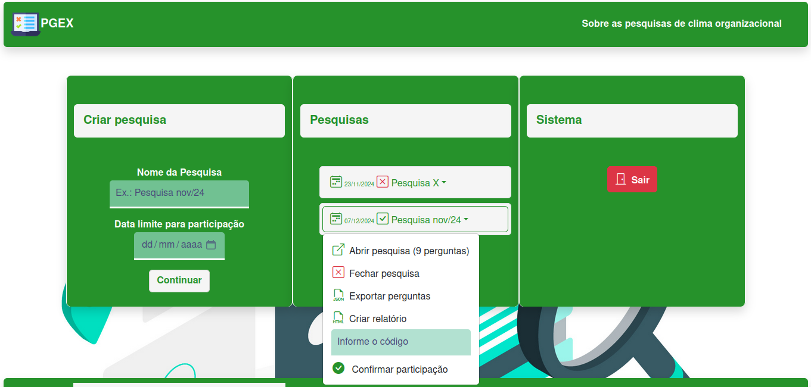

# PGEX Client


Software front-end responsivo para criação de pesquisas e geração de relatórios. Consome a API [PGEX-API](https://github.com/Hiago-Laureano/pgex-api).

<h1 align="center">
    
</h1>

## Instalar dependências
```
npm install
```

### Compilar e executar para desenvolvimento
```
npm run serve
```

### Compilar para produção
```
npm run build
```

### Configuração personalizada
[Referência de configuração](https://cli.vuejs.org/config/).
